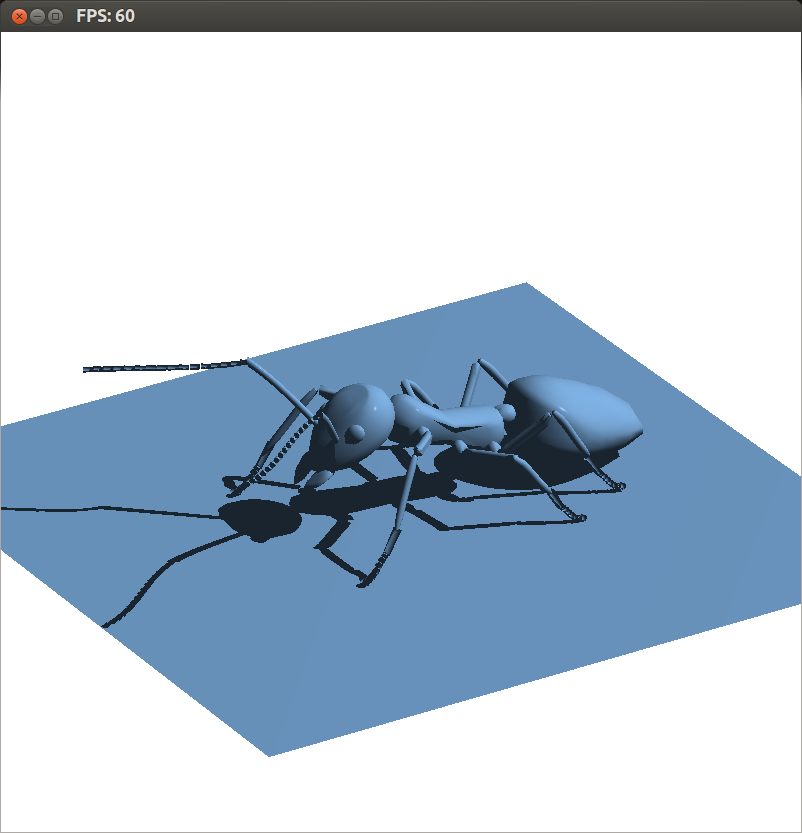
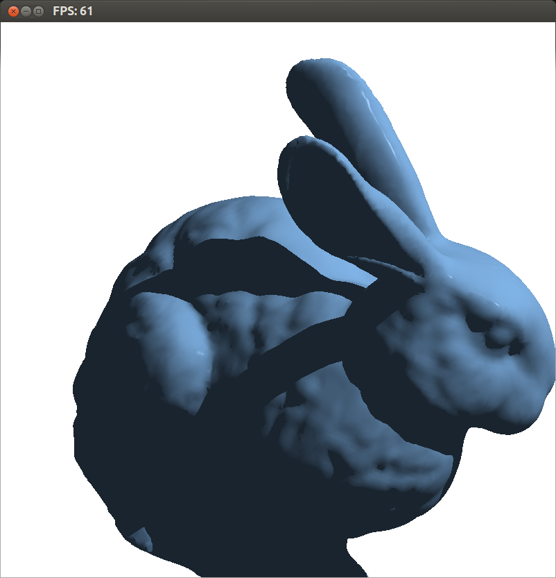
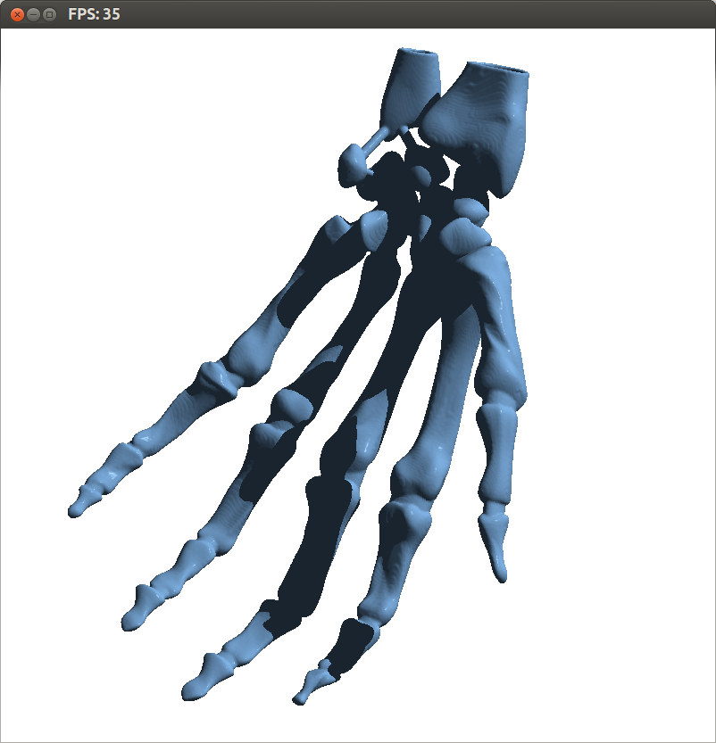
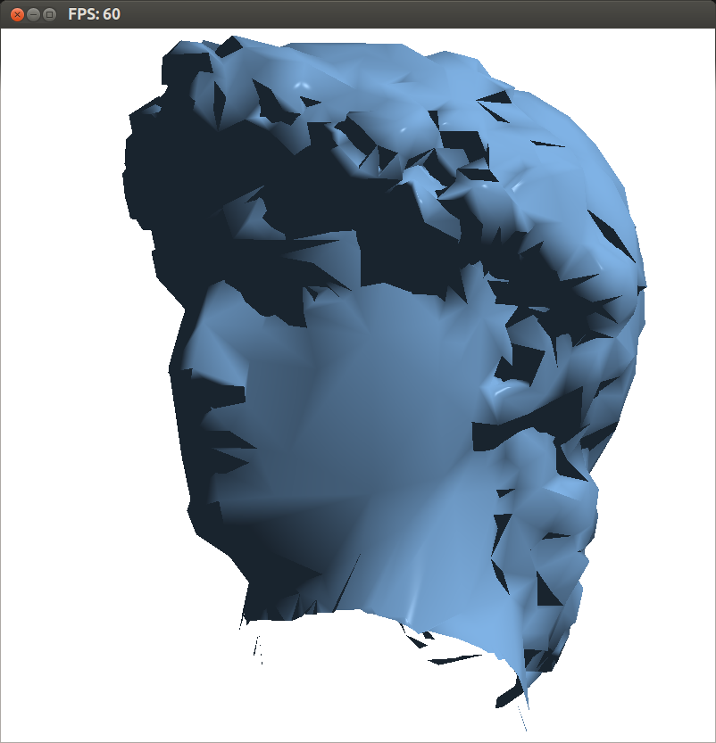
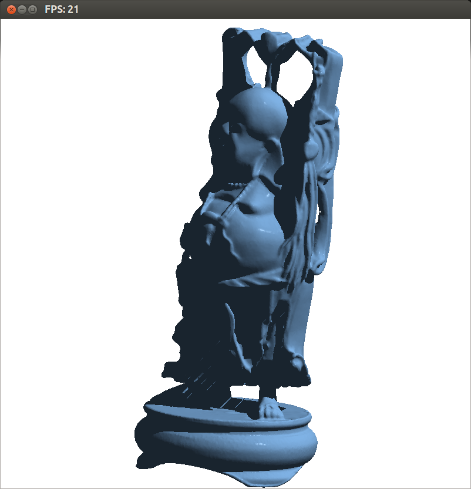

# Shadow Volumes

A pretty vanilla implementation of shadow volumes in openGL 3.3,
done for CSCI 544 Advanced Computer Graphics Spring 2014, at th
Colorado School of Mines, Project 2.

Models that work with the viewer code can be found here:

- small:
  https://mega.co.nz/#!Kd5UibqC!0vRlRhSZmsGAzNqChEXqulxFHjhE4qaRLtWWd2fGGG0
- medium:
  https://mega.co.nz/#!LdQzjTBZ!GHzKOWa8Zhx357IT8_I5sQj3HQuOZavj35lumDOXUx4
- small + medium + large:
  https://mega.co.nz/#!3FJFVKBL!ri59V_SLqz1GkHu8uUW9lZvmfEax85CfV_bxhqXVT1o

# Screenshots

Shadow volumes don't look quite as nice with low-poly models:

Models with holes in the mesh generate artifacts (see shadow on legs):

# Running

Compile with:

    make

Then run the viewer:

    ./viewer <model file>

# Development

Use `reload.sh` to reload the viewer when any of the shader files
are modified. You'll need inotify-tools installed.

    ./reload.sh <model file>
